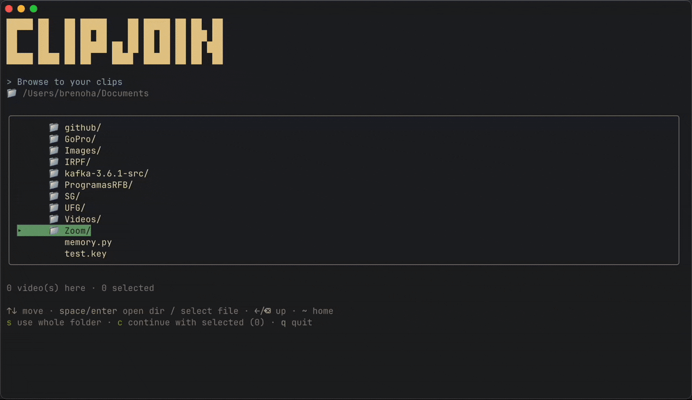

# ClipJoin 🎬

**Merge your videos into one file: fast, lossless, and right from your terminal.**

> _Back from a trip with a memory card full of GoPro clips? Select them, stitch them into
> one file, and upload the whole adventure to YouTube in one shot, public or unlisted,
> your call._

Run ClipJoin, pick the files you want, reorder them, and hit join. Simple as that.



Matching clips merge **losslessly in seconds**, with no re-encoding and no quality loss
(40×1GB in seconds, not hours). Different formats? ClipJoin re-encodes them for you. No
flags, no config, just a clean keyboard-driven flow from folder to finished file.

## How it works

1. A short **clips-merging animation** plays on launch while ClipJoin checks for ffmpeg.
2. **Browse** the filesystem to a folder of clips (or select individual files).
3. Each clip's embedded `creation_time` (falling back to file mtime) sets the true
   capture order, which you can then reorder by hand.
4. **Toggle** clips in/out and rename the output, watching the live preview (clip
   count, total duration, size, lossless-vs-re-encode).
5. On join, ClipJoin first tries a **lossless concat** (`ffmpeg -c copy`), which keeps full
   quality and works when clips share a codec/resolution. If that fails (e.g. mixed formats
   or codecs) it **re-encodes** automatically (H.264/AAC, slower but always works).

Optionally, add a **crossfade transition** between clips (press `t` on the arrange screen).
It's off by default; enabling it re-encodes the output (transitions can't be done losslessly).

Every joined file is written to a fixed **ClipJoin** folder in your home —
`~/Movies/ClipJoin` on macOS, `~/Videos/ClipJoin` on Linux/Windows — so `clipjoin`
saves to the same predictable place no matter which directory you run it from. Files
get a timestamped default name (`joined_output_YYYY-MM-DD_HHMMSS.mp4`), so repeated
joins never overwrite one another. Point it elsewhere for a run with `--out`:

```bash
clipjoin --out ~/Desktop         # write joined videos to ~/Desktop instead
```

## Install

Install globally with npm — you get a `clipjoin` command anywhere
(`clip-join` works too, they're the same thing):

```bash
npm install -g clip-join   # then run: clipjoin
npx clip-join              # or run once without installing
```

**ffmpeg is required** (it bundles `ffprobe`) — install it with your package
manager if you don't have it:

```bash
brew install ffmpeg        # macOS
sudo apt install ffmpeg    # Debian/Ubuntu
```

<details>
<summary>Optional: one-line installer</summary>

Prefer a single command that also checks Node + ffmpeg for you and fixes PATH?

```bash
curl -fsSL https://raw.githubusercontent.com/BrenoHA/clip-join/main/install.sh | bash
```

It just wraps `npm install -g clip-join` with a few pre-flight checks.

</details>

## Requirements

- **Node.js 18+**
- **ffmpeg** (bundles `ffprobe`) on your `PATH`

## Building from source

```bash
git clone https://github.com/BrenoHA/clip-join.git
cd clip-join
npm install
npm run build
```

## Usage

```bash
clipjoin                 # after installing globally
clipjoin ~/clips         # jump straight into a folder

npm run dev              # dev mode from source, no build step (via tsx)
npm start                # from source, after `npm run build`
npm start ~/clips        # jump straight into a folder

Everything is keyboard-driven.

**Browsing**

| Key                          | Action                                               |
| ---------------------------- | ---------------------------------------------------- |
| `↑ ↓`                        | Move the cursor                                      |
| `space` / `Enter`            | Open a directory, or select/deselect a video file    |
| `←` / `Backspace` / `Delete` | Up a directory (cursor lands on the folder you left) |
| `~`                          | Jump to your home directory                          |
| `s`                          | Use every video in the current folder                |
| `c`                          | Continue with the files you've selected              |
| `q`                          | Quit                                                 |

**Arranging & joining**

Once you've picked your clips, arrange them and watch the live preview (clip count,
total duration, size, and whether the join will be lossless):

| Key               | Action                                        |
| ----------------- | --------------------------------------------- |
| `↑ ↓`             | Move the cursor                               |
| `space` / `Enter` | Toggle a clip in/out of the join              |
| `Shift+↑ ↓`       | Reorder the selected clip                     |
| `o`               | Rename the output file (saved to the ClipJoin folder) |
| `t`               | Toggle the transition (None / Crossfade)      |
| `j`               | **▶ Start the join**                          |
| `esc`             | Back to the browser                           |
| `r`               | Join again (summary screen)                   |
| `q`               | Quit                                          |

## Project structure

The interface is built with [Ink](https://github.com/vadimdemedes/ink) (React for the
terminal), the same UI framework behind Claude Code, with the video engine kept cleanly
separate from it:

```
src/
  index.tsx            # CLI entry (bin: clipjoin / clip-join)
  config.ts            # extensions, output dir, default name, encode settings
  core/                # domain logic, no UI, unit-testable
    videos · probe · join · output · format · types
  ui/                  # Ink presentation layer
    App.tsx            # phase router (splash → browse → edit → join → summary)
    theme.ts
    screens/           # SplashScreen, BrowseScreen, EditScreen, JoinScreen, SummaryScreen
    components/        # Banner, Header, PreviewPanel, ProgressBar, KeyHints
    hooks/             # useFullscreen
```

`core/` never imports Ink, so the engine can be exercised without a terminal.

## Testing

Unit tests cover core functionality and can be run without ffmpeg installed:

```bash
npm test                # run all unit tests
npm test -- --watch     # run tests in watch mode during development
npm run test:ui         # open test UI in browser
```

Tests use [Vitest](https://vitest.dev/) and cover formatting utilities, video sorting,
codec detection, and join logic. See `src/core/*.test.ts` for examples.

## Roadmap

- Per-clip trimming (in/out points).
- Audio normalization.

Mixed file types / codecs already work today via the automatic re-encode fallback.

## Contributing

Contributions are welcome. See [CONTRIBUTING.md](CONTRIBUTING.md) for setup, coding
conventions, and the PR process.

## Notes

- A successful lossless stream copy doesn't guarantee every player handles a file with
  slightly different per-clip encoding perfectly. If playback looks off, the clips likely
  need re-encoding (ClipJoin falls back automatically when stream copy fails).
- **Original files are never modified or deleted.**
- Output names are always confined to the output folder (a path typed into the rename
  field is reduced to its basename); use `--out <dir>` to change the folder itself.

## License

[MIT](LICENSE) © BrenoHA
